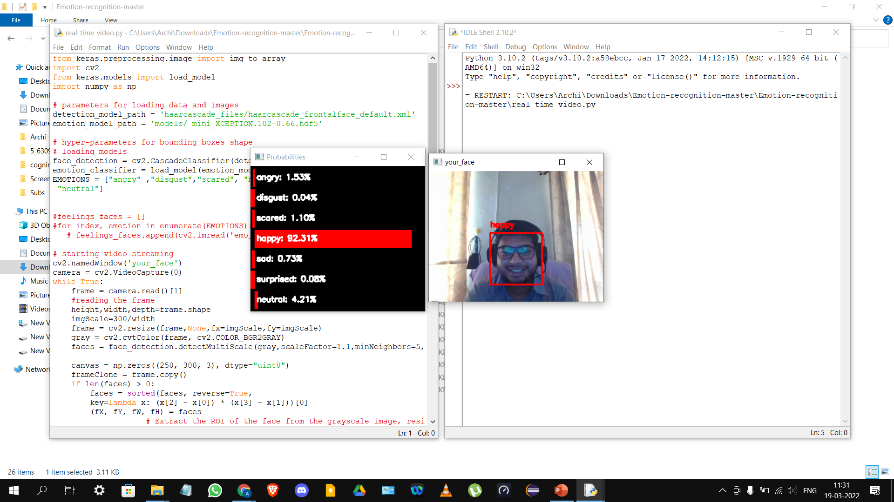

# Real-Time Facial Emotion Recognition

A deep learning-based facial emotion recognition system using CNN, Mini-XCEPTION, OpenCV, and the FER2013 dataset.

## Demo



## Features

* Real-time emotion detection using webcam
* Face detection using Haar Cascades
* CNN-based emotion classification
* Trained on FER2013 dataset

## Emotions Detected

* Angry
* Disgust
* Fear
* Happy
* Sad
* Surprise
* Neutral

## Dataset

This project uses the FER2013 facial expression dataset.

Dataset Source:
https://www.kaggle.com/datasets/msambare/fer2013

The dataset contains facial images categorized into seven emotions:

* Angry
* Disgust
* Fear
* Happy
* Sad
* Surprise
* Neutral

The dataset is not included in this repository due to size limitations.

## Technologies

* Python
* TensorFlow / Keras
* OpenCV
* NumPy

## Installation

Clone the repository:

```bash
git clone https://github.com/ArchismaanBanerjee/Emotion-Recognition-System.git
```

Install required libraries:

```bash
pip install tensorflow keras opencv-python numpy pandas matplotlib
```

## Run

```bash
python real_time_video.py
```

## Results

* The model achieves approximately 66% validation accuracy on the FER2013 dataset.
* The system performs real-time emotion recognition using webcam input.

## Future Improvements

* Improve model accuracy
* Detect multiple faces simultaneously
* Deploy as a web application
* Add emotion analytics dashboard

## Project Structure

```text
Emotion-Recognition-System/
│
├── haarcascade_files/
├── models/
├── screenshots/
├── load_and_process.py
├── train_emotion_classifier.py
├── real_time_video.py
├── Report.pdf
├── Presentation.pdf
└── README.md
```

## Author

Archismaan Banerjee

GitHub:
https://github.com/ArchismaanBanerjee

```
```
